#Sales Manager System
---
2014-11-28

##Content
- Features
    - Basic
    - Advanced
- Installation
- Try the binary program
- Model Design
- About the client program
- Main class in the Tiny_DB
- Member division

---

##Features
####Basic
>User can use the following features via client program directly.

1. Allow user to input data from file. We support read `.csv` format data file.  ( User can edit the data in excel and save file to `.csv` format ).
2. Allow user to input data via console
3. Allow user to query via file input`.csv`
4. Allow user to query via console input
5. Allow user to save query result to disk ( use auto save )

####Advanced
>Powered by Tiny-DBMS( We have implement a simple DBMS( Database Management System ) which has some of the standard DBMS's basic features and we use it as our backend service. ). However, The following features can be only called by client program.

1. Create a table with passing a name.
2. Alter the table properties:
    -  Add field ( Name,Type,Price... )
    -  Add and change key ( Set Name to key or set ID to key... )
    -  Add index and change index ( Set Name to index or set Type to index... )
    -  Drop field
3. Insert data record
4. Update data record
5. Delete data record
6. Select specific data record

##Installation
>We have given the Makefile and source files which stored in SMS/source. You can compile the source and make the project by yourself.

##Try the binary program
>The program was compiled in `Linux debian7-amd64` and the GCC version is `gcc version 4.7.2` . You can find the binay program in the directory SMS/bin. All the data file should save in the same directory with binary program.

`More detail thing write here`

---
>In the following, i'll introduce our program and some other things.

##Model Design
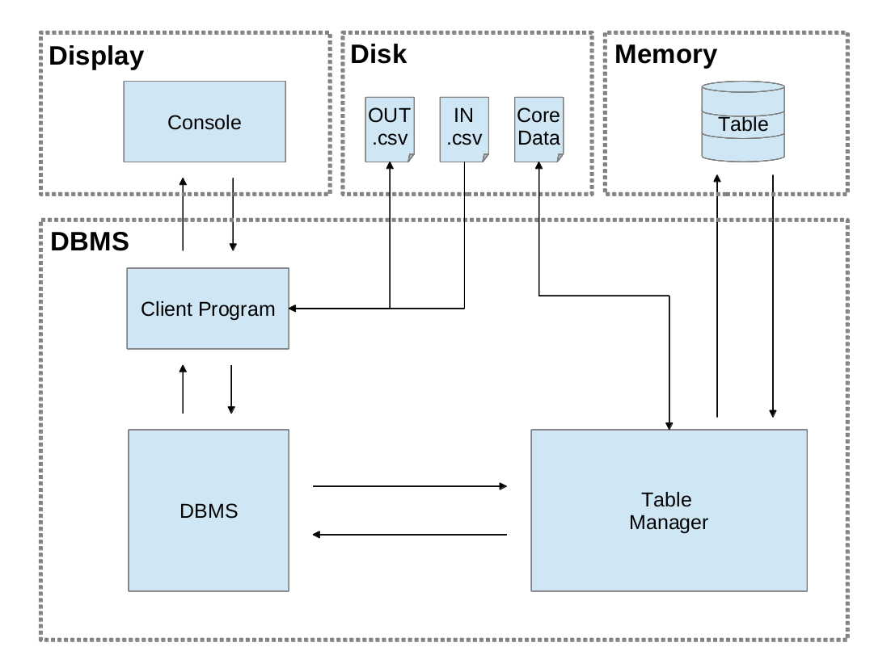

##About the client program
This is the first input file - figure1.txt which user defined:
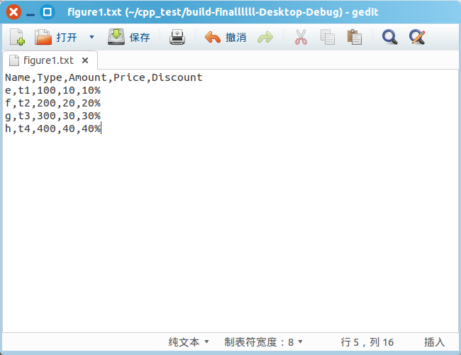
And the outfile - figure2.txt has existed some data - actually its the DB's core data file:
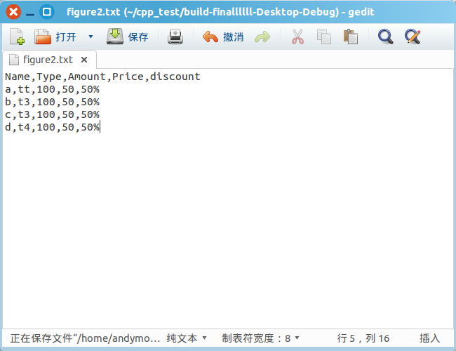
In console, we choose 1 - Insert data from file:
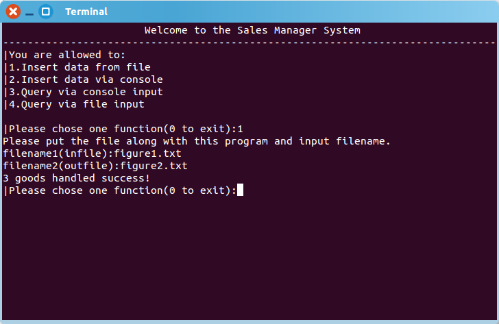
After above operate, we get the result infomation. And, figure2.txt updated:

In console, we choose 2 - Insert data via console, and choose figure1.txt to save the data:
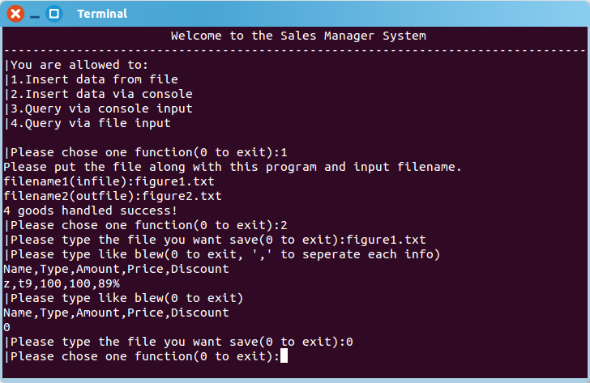
After above operate, we get the result infomation in cosole, and, figure1.txt updated:
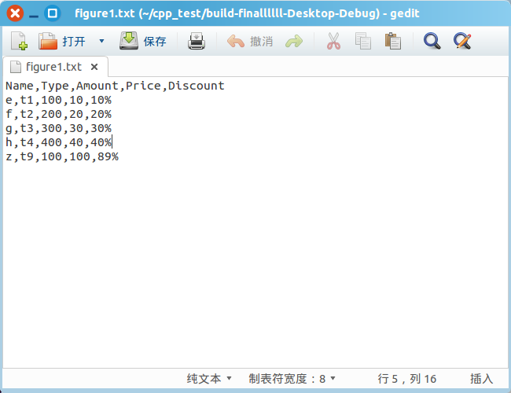
In console, we choose 3 - Query via console and the console shows the result:
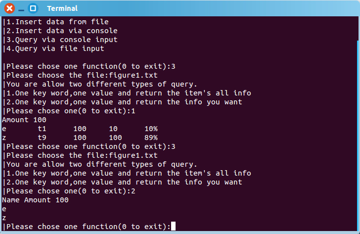
In console, we choose query via file input:
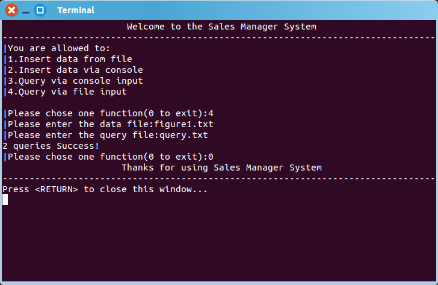
Input file - query.txt:
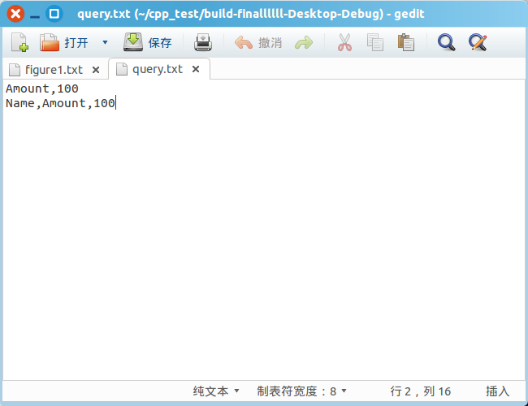
Get the result in result.txt:
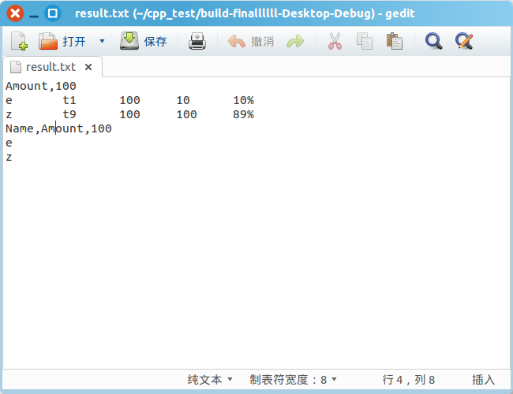
User can edit data in excel , then save into `.csv` format:
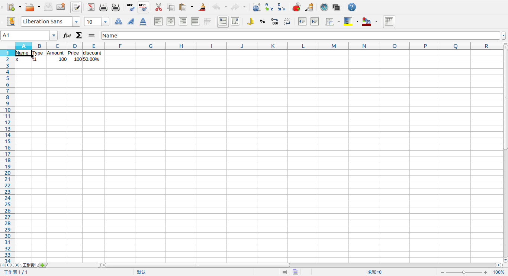
In console, we choose 1 - Insert data from file:

Then, the DB data file updated:
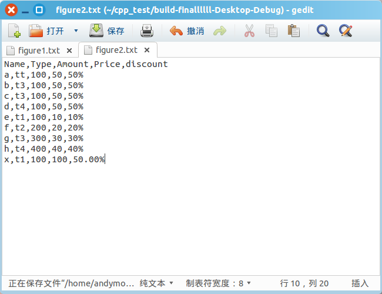

##Main class in the Tiny-DB
We designed three main class in the Tiny-DBMS
```c++
/*
 * This struct is to organize each data record
 */
class Row
{
public:
    Row();
    Row( const vector<string> &_values );
    vector<string> values;
    string key_value;           // init(values[0])
};
```
```c++
/*
 * This class have the table's properties and provide
 * methods for DBMS to organize data in the table and
 * construct the 2D table.
 */
class Table
{
public:
    Table();
    Table( const string &_name );
    void init( const string &_name );
    bool create( const string &_name );

    /*
     *  Provide APIs for DBMS to get table's infomation
     */
    const string & getName() const { return name; }
    const string & getKey() const { return key; }
    const string & getIndex() const { return index; }

    const vector<string> & getColumns() const { return columns; }

    const size_t & getColumnsCount() const { return columns_count; }
    const size_t & getRowsCount() const { return rows_count; }

    vector<string> & getKeyValues();

    /* $start DDL */
    void add_column( const string &_column_name );
    /* $end DDL */

    /* $start DML */
    vector<vector<string> > & select( const string &_column_name,
                                      const string &_value );
    vector<vector<string> > & select( const string &__column_name,
                                      const string &_column_name,
                                      const string &_value );
    void update( const string &_column_name,
                 const string &_value,
                 const string &_which_column,
                 const string &_which_column_name );
    void insert( const vector<string> &_values );

    void delete_row( const string &_column_name,
                     const string &_value );
    /* $end DML */
private:
    /*
     * Save table name and its data file name
     */
    string name;        // init("NULL")
    string data_file;   // init("NULL")

    /*
     * Save the table's key and index
     */
    string key;         // init("NULL"), default("columns[0]")
    string index;       // init("NULL")
    vector<string> key_values;

    /*
     * Start core data orgnization method
     *  - 2D table
     */

    /*
     * Core data title
     *  - Each operator with colums must update colums_count
     */
    vector<string> columns;
    size_t columns_count;

    /*
     * Core data
     *  - Each operator with rows must update rows_count
     */
    vector<Row> rows;
    size_t rows_count;

    /*
     *  Save query result;
     */
    vector<vector<string> > result_rows;

    /*
     * Auto save data when data changed
     */
    void open();
    void read_data();
    void save_data();
};
```
```c++
class DBMS
{
public:
    DBMS();
    DBMS( const string &_table_name );
    ~DBMS();

    bool bind( const char *_table_name );
    bool bind( const string &_table_name );
    void unbind();

    const string & get_table_name() const { return table_name; }
    bool get_bind_state() const { return is_bind; }

    /* $begin DDL */
    /*
     *  CREATE TABLE table_name=value
     */
    bool create_table( const string &_table_name );
    /*
     *  AlTER TABLE table_name
     *  ADD column_name [datatype]
     */
    void alter_table_add_column( const string &_column_name );

    /* $end DDL */

    /*  $begin DML */
    /*
     *  SELECT row FROM table_name
     *  WHERE _column_name=_valave_data();ue
     */
    vector<vector<string> > & select( const string &_column_name,
                                      const string &_value);

    /*
     *  SELECT __column_name FROM table_name
     *  WHERE _column_name=_value
     */
    vector<vector<string> > & select ( const string &__column_name,
                                       const string &_column_name,
                                       const string &_value );

    /*
     *  SELECT _columns_name FROM table_name
     *  WHERE _column_name=_value
     */
    //vector<vector<string> > & select( const vector<string> &_columns_name,
    //                                  const string &_column_name,
    //                                  const string &_value);

    /*
     *  UPDATE table_name SET _column_name=_value
     *  WHERE _which_column_name=_which_column_value
     */
    void update( const string &_column_name,
                 const string &_value,
                 const string &_which_column_name,
                 const string &_which_column_value );
    /*
     *  INSERT INTO table_name
     *  VALUES(val1, val2, val3, ...)
     */
    void insert( const vector<string> &_values );
    /*
     *  INSERT INTO table_name
     *  COLUMNS(col1, col2, ...) VALUES(val1, val2, ...)
     */
    void insert( const vector<string> &_columns,
                 const vector<string> &_values );

    /*
     *  DELETE FROM table_name WHERE _column_name=_value
     */
    void delete_row( const string &_column_name,
                     const string &_value );
    /* $end DML */
private:
    bool is_bind;       // init(false)
    string table_name;  // init("NULL")

    Table table;
};
```

##Member division

| Name   |Job             |
| :-----:| :--------:     |
| 何志强 |Backend Design  |
| 卿越   |Frontend Deisign|
| 刘芳   |Program Test    |

---
The end.
